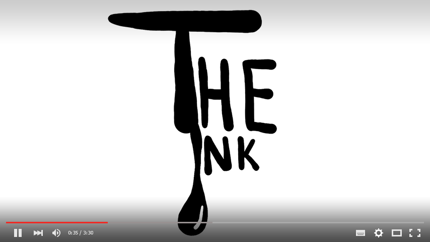

# TheInk Retrospective

I designed, drew, animated and developed The Ink as my entry into the 2019 Awful Summer Jam. It was a four-week gamejam with the theme of '60 seconds'. 

The Ink is a platformer depicting a 60-second cartoon, animated with the program Spine. Escape requires difficult platforming to keep above a rising sea of ink, and avoiding a number of surreal doodles. To survive, the player has a limitless ability to rewind the game. This mechanic leads to some fun results: jumps can be quite difficult, because the player can quickly retry them any number of times. The map can have many paths, as the player can retry to find an optimal, efficient route forward. As a result, players experience various parts of the 60-second animation repeatedly.

Rewinding introduces a few interesting technical and design challenges. Audio must cleanly rewind with the player. This way if the music accompanies a game event, the audio cue will always occur at the same time. Animation and particle effects must also rewind. I created Unity scripts to reverse my Spine animation frames, background-music, and store the player's positional data. All entity movement besides the player character is tied to a global timer, which is rolled back when the right bumper is used.

I enjoy drawing weird and surreal characters, which led to a number of interesting entities you interact with. I broke down my drawings into many layers that can all be cleanly interpolated and deformed for animation purposes. 

I chose to use a black and white style to emphasize the inky topic of the game. This meant conveying information to the player in a way that isn't based on color. You'll see the theme of 'bubbles' whenever the player is intended to jump onto a moving object. Each platform has a randomized, bubbling surface. Spine allows for dynamic tracking of objects, so I was also able to have a number of enemies track the player's movement with their eyes.

I learned a number of lessons from The Ink. Because the game is an animated platformer, my greatest challenge was creating a player controller that felt fluid. Mid-air control is important, as the rewind mechanic results in the player repeatedly adjusting their movement during a jump. Ultimately I would have liked to spend more time testing and refining the controller. One part of the design that resulted in negative feedback was how 'open' the game is. A player can spend a lot of time following an inefficient path, only to have to rewind a large portion of the game to course-correct. It's more fun to use rewind to make difficult jumps than it is to find the fastest route through the game.

Feedback indicated my drawings and animation were a highlight of the Game Jam, which felt great: The Ink is my first attempt at a fully hand-drawn game in this style. I'm very happy with how my animations and the rewind mechanic turned out, and hope to use this type of animation in future projects. Creating, animating and implementing these creatures in a four-week timeframe was quite challenging. Though The Ink did not win Game of the Jam, it did rank second-place for 'Most Good Looking' entry. Since learning animation was one of my main goals for this project, I'm very happy with that result and consider the game a great success.

